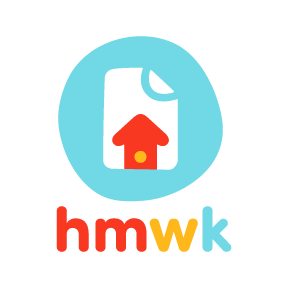
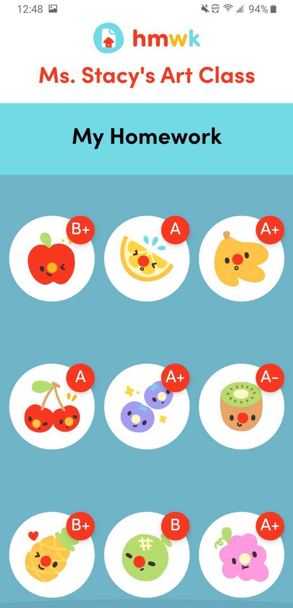
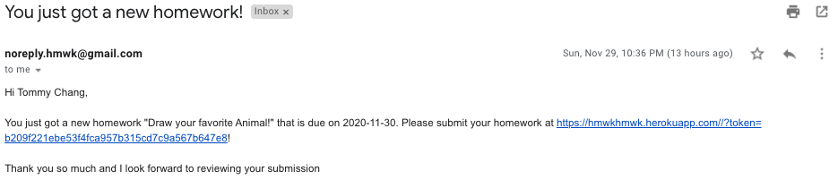
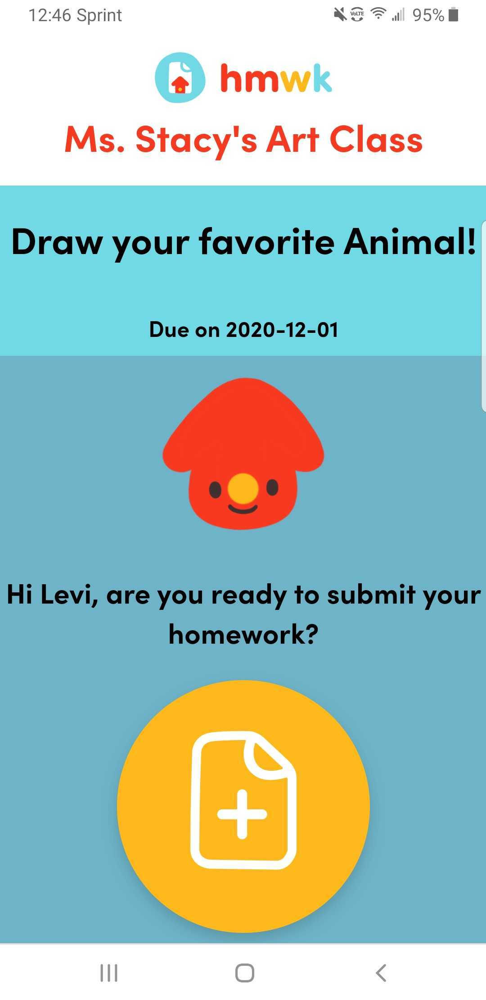
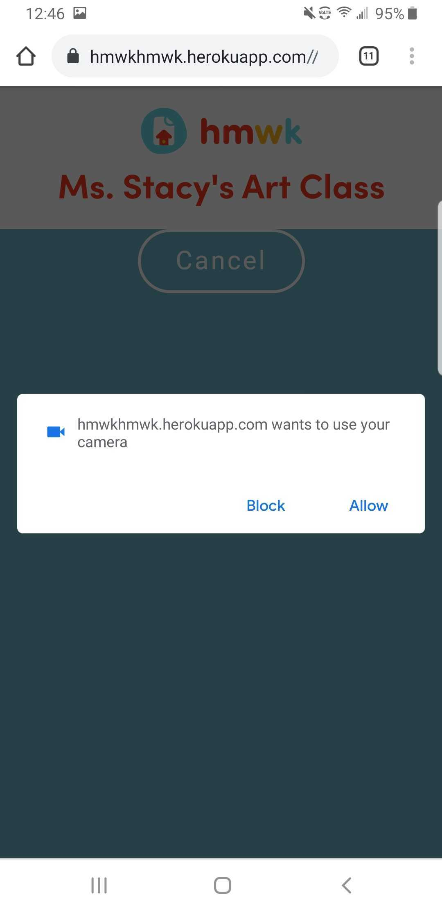
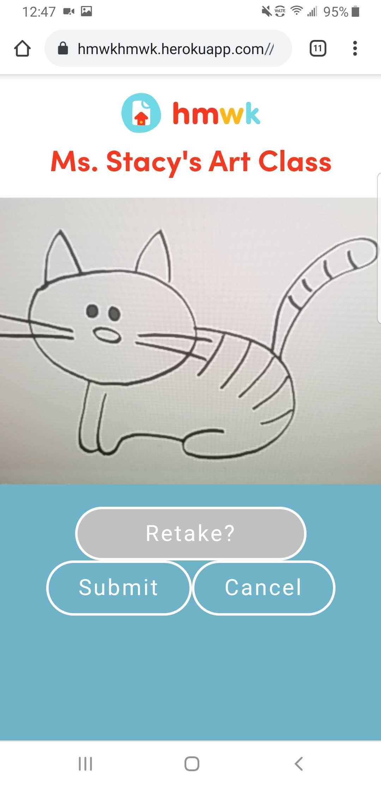
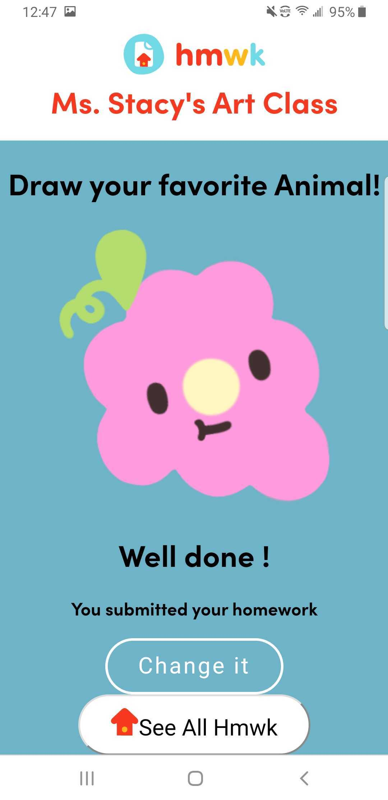

<p align="center">
  
</p>

As part of the monday.com Apps Marketplace challenge, we've created "hmwk", an app that lets your child scan their homework and "turn it in" to their teacher, right from their phone! Because hmwk integrates with monday.com, teachers can use the monday.com platform to receive homeworks in a central location and keep track of each student's development and learning.

---

# Install

Add hmwk to monday.com!

<a href="https://auth.monday.com/oauth2/authorize?client_id=2b8295571169c8715ed9ad765153a96f&response_type=install">  </a>

Check out our video submission and demo [here](https://youtube.com)!

Once setup, your students will be emailed a personalized link to https://hmwkhmwk.herokuapp.com to submit and view their homework.

---

# hmwk

**hmwk** helps teachers distribute, collect and track their students' homework assignments. We integrate with monday.com through board templates and smart recipes logic that neatly manage the process.

Because hmwk integrates with monday.com, teachers can use the monday.com platform to receive homeworks in a central location and keep track of each student's development and learning.

If you are a developer and want to try our app out, please check out the Dev Guide.

If you're interested in learning more about our app, feel free to read our Hackathon Submission entry! 😊

<p align="center">
  
</p>
<p align="center"> Screenshot of our student app interface</p>

---

# 📖 Hackathon Submission 📖

<details><summary>Click to Expand</summary>

<details><summary>Inspiration</summary>

## Inspiration

## 👩🏻‍🏫🧑🏻‍🏫👩🏼‍🏫🧑🏿‍🏫👩🏽‍🏫💻🏫📱🧒🏽🧒🧒🏾🧒🏻🧒🏼🧒🏿

2020 has been a year of change. While most tech teams have had a relatively swift change to working from home, the same cannot always be said about teams in the classroom, especially for elementary schools. We wanted to build something that could make a difference and improve the lives of the millions of teachers, students, and parents who are distance learning around the world.

Of the many problems that we looked into, this one in particular had a strong potential to integrate with the monday.com’s platform and services, so we chose to develop a strong yet simple solution for it.

<p align="center">
  
</p>

</details>

<details><summary>What our App does</summary>

## What it does

Our fun and simple app makes it extremely easy for younger students (or their busy parents) to upload photos of their homework. For the teachers who moved their classroom logistics online, hmwk is an easy way to manage, collect, and grade assignments. For the students and parents that aren’t prepared to challenge technology’s learning curve, hmwk makes homework about learning again.

To start, teachers need a monday.com account and to download our hmwk board templates. The very first time they use it, they add their students onto the "Students" board. On the "Homework Assignments" board, they can plan their homework assignments as far as they want, and once they change the status of a specific homework assignment to "Send to Students", hmwk's app logic will populate the "Homework Tracking" board automatically, so that each homework assignment is a group, and within that group we have an item for each student (from the "Students" board).

<p align="center">
  
</p>
<p align="center">
  
</p>

On the student side, the process is even smoother and simpler. When the teacher sent the Homework Assignment, our service automatically sends an email to all the students form the Students board alerting of new homework. Each student gets an individual unique link generated by our app, so that they don't need to sign in, just click the link and upload the photo!

<p align="center">
  
</p>

When the student submits the photo using the URL they received by email, they will get a screen confirmation that the hmwk was sent.

The teacher, instead of collecting assignments through email, just goes to that "Homework Tracking" board and can see all the submissions there by clicking on the hmwk files. They can also assign grades to the assignments on the very same board, and send an automated email through a monday.com integration to each student with their grade.

<p align="center">
  
</p>

</details>

<details><summary>How we built it</summary>

## How we built it

We built our app using JS. In the back-end, we use Node.js, Express.js for routing, and services/ controllers/ middlewares for the monday.com API. We rely on the monday.com SDK to interact with the monday.com API. We have routes that serve both monday.com traffic and student (end user) traffic. We have a Redis database to cache data that is routinely accessed so we don't need to continuously make calls to the monday.com API.

In the front-end, we use React with hooks to manage the state and switch between components within the app. We also used the monday.com API playground to know which variables to use to make our calls. For the styling, we started off with raw CSS, but later implemented styled components within our component folder for styling specific to that component.

We have also made good use of an external repo to build the camera component. The tutorial for it can be found [here](https://blog.logrocket.com/responsive-camera-component-react-hooks/).

Below are some screenshots of the app itself, as the students see it.

<p align="center">Student get to this screen when they click their unique link: </p>

<p align="center">
  
</p>

<p align="center">App asks for camera permissions: </p>

<p align="center">
  
</p>

<p align="center">Students can take photos from the web browser in their phone:</p>

<p align="center">
  
</p>

<p align="center"> Student successfully uploaded hmwk:</p>

<p align="center">
  
</p>

<p align="center"> Student can also track all their grades: </p>

<p align="center">
  
</p>

</details>

<details><summary>Why it matters (UX Research)</summary>

## Why it matters (UX Research)

For a developer debugging deep in the trenches of code, the user isn’t always top of mind. Our team dedicated time to researching our competitors, speaking to teachers and families of young students to identify just what we could build to make their lives a little easier.

Key insights we discovered were just how much of a challenge technology could be for elementary to middle school teachers and students. Education technology such as Google Classroom is a big commitment for younger students that aren’t quite ready for large homework loads. Kids should be more focused on developing a love for learning and distance learning doesn’t have to be a barrier to that.

These exercises in empathy helped develop a better understanding of our users’ problems and identify what features to prioritize with our time constraints. We are proud to know the value behind our work.

</details>

<details><summary>Challenges we ran into</summary>

## Challenges we ran into

We are a group of 4 developers and a UI-UX designer. We wanted to participate in the challenge together, because working with others is always more fun and enriching, alas more difficult. Coordinating online when everyone has different schedules has been challenging, but we are proud we made it work.

Learning the monday API took a while at the beginning, specially since most of us didn't know graphQL. While the monday.com documentation and the developers workshop helped, there were some areas that were quite unique to our app and that took a lot of crunching to solve.

</details>

<details><summary>Accomplishments that we are proud of</summary>

## Accomplishments that we are proud of

Our app works! It has the potential of helping a lot of teachers, especially elementary school teachers, where homework is still mostly written by hand.

We are very proud of forming a diverse team. We have 2 SWEs, 2 recent-grads SWEs (one was formerly a marketer) and a UI-UX designer. This helped us look at the problem with a wider lens, we learned a lot about UI design, and our designer also learned some of the more technical aspects to solving a problem.

</details>

<details><summary> What we learned</summary>

## What we learned

Developer takeaways:

1. Establish contact with monday.com dev support early on, so you have expertise on the platform you're developing for.

2. Deploying early can help save time down the road

3. Before deleting all your playgrounds and setting up a demo for recording, record a quick video of the playground in case something goes wrong with the demo setting! It happened to us :(

Designer takeaways:

1. The role is 50% research, 50% design, and 100% leading conversations about users.

2. Designing it is faster than building it. So make sure it’s worth building.

</details>

<details><summary>What's next for hmwk</summary>

## What's next for hmwk

We had a lot of great features planned for hmwk, but unfortunately had to cut them down to fit our time constraints. Our developers are still learning front-end as well, so building the UI according to the prototyped design is still a work in progress. Users, especially young ones, are more responsive to interfaces with a lot of color and interactions, so our priority is to refine the existing UI with micro-interactions.

1. Multiple Uploads. Allows users to upload and preview multiple images to one assignment. The assumption is that most elementary grade students' homework assignments wouldn't need more than 1 page, but we would like to add the ability of multiple uploads for the older students as well.

2. Rewards System. Expand the sticker reward feature to help motivate students. This feature is currently still hard-coded, but we want to be able to make it dynamic.

3. Smart Scan. Using machine learning, we want to be able to find when a hmwk submission is blurry, slanted, or too dark/bright. When the image's quality isn't good enough, we want to pop a modal to inform the student to please capture a new photo to submit.

</details>

</details>

---

# 💻 Dev Guide 💻

<details><summary>Click to Expand</summary>

### Install NodeJS from scratch on Mac OS X

This step is optional.

```bash
set -euxo pipefail

# Update Brew
# * I had to specify --debug --verbose since it's otherwise silent and looked
#   like it was hanging.
brew update --debug --verbose

# Clean slate
brew uninstall --ignore-dependencies node
brew uninstall --force node
brew uninstall --ignore-dependencies nvm  # If you have nvm
brew uninstall --force nvm                # If you have nvm
cd $HOME && rm -rf .nvm .npm .node-gyp .node_repl_history

# Install nvm
# * https://medium.com/@jamesauble/install-nvm-on-mac-with-brew-adb921fb92cc
# * https://github.com/nvm-sh/nvm
brew install nvm
# follow instructions, restart terminal, then run this. If it prints 'nvm', success!
command -v nvm

# Install the currently latest LTS version of node (currently it is 14.15.0)
nvm install 14.15.0
nvm use 14.15.0
```

### Other dependencies

```bash
# Sorry, you need Mac OS X ><
# This step should be solved via Heroku buildpack on Heroku.
brew install imagemagick
```

In the project root directory (`hmwk/`), the `.nvmrc` file is set to `14.15.0`, so you can also just run `nvm use` to switch to that version. Note that you don't have to do this every single time.

### Personal workspace playground

When developing, it is useful to have your own playground workspace.

1. In one tab, run `npm run expose`. In another tab, run `npm run server-dev`. Copy the `https://` ngrok URL. You will need this for step 2.

2. Create a "Reset Boards (`YOU`)" recipe. For the subscription URL, put in your ngrok url suffixed with `/reseed/subscribe`, e.g. `https://7cc0c3259e14.ngrok.io/reseed/subscribe`. Do the same for `/reseed/unsubscribe`.

3. Create your own workspace, e.g. named "`<YOU>` Playground".

4. Click "Add" --> "New from template" --> "See More Templates".

5. Search for and use "hmwk for teachers".

6. Click "Integrate" --> "+ Add new integration".

7. Search for and use "Reset Boards (`<YOU>`)". Fill out the recipe sentence completely.

That's it! Now if you want to reseed your boards, just run:

```bash
npm run reseed
```

Note: Don't reseed too often in a short amount of time. [monday.com rate limits you](https://monday.com/developers/v2#rate-limits-section).

### Build the app and run it locally with Heroku command

You will need to install [`Heroku CLI`](https://devcenter.heroku.com/articles/getting-started-with-nodejs#set-up) first

```
npm install
heroku local web
```

The app will now be redirected to http://localhost:5000/

</details>

---

# 🌟 The Team 🌟

## Software Engineers (fullstack):

🧑🏻‍💻 [Victor Chen](https://www.linkedin.com/in/victor-lam-chen)

👩🏻‍💻 [Cecilia Yu Chung Chang](https://www.linkedin.com/in/cecilia-yu-chung-chang)

🧑🏻‍💻 [RT Lin](https://www.linkedin.com/in/rt-lin)

👩🏻‍💻 [Yunice Xiao](https://www.linkedin.com/in/fishxy2)

## UX-UI Designer:

👩🏻‍💻 [Kay Chen](https://www.linkedin.com/in/kay-chen-9a9679165)
